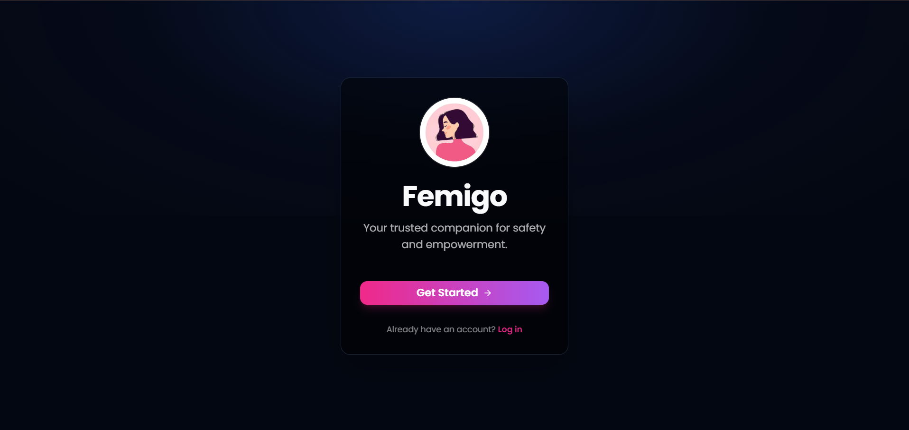
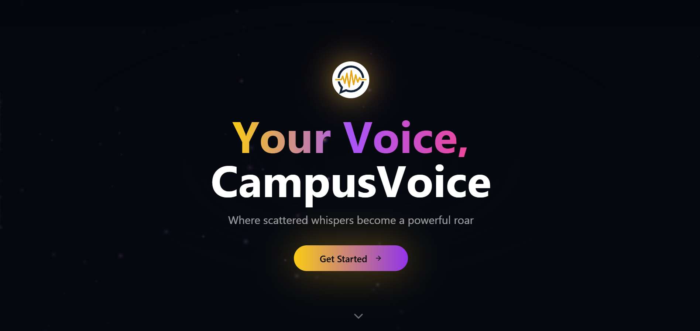
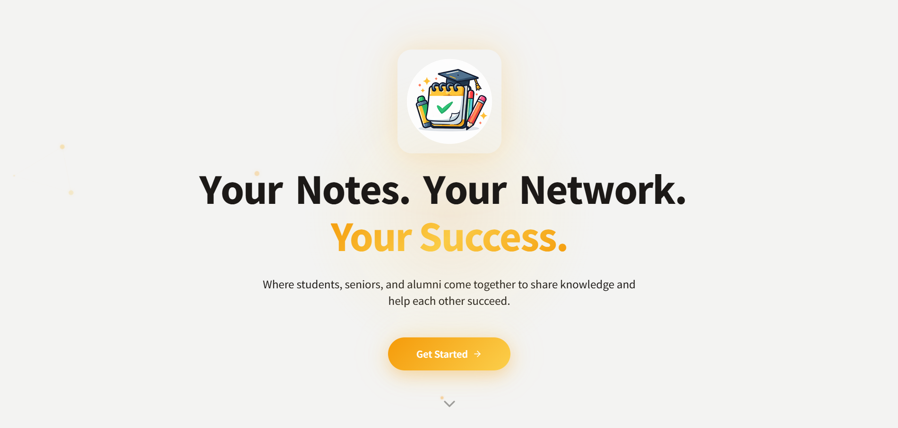
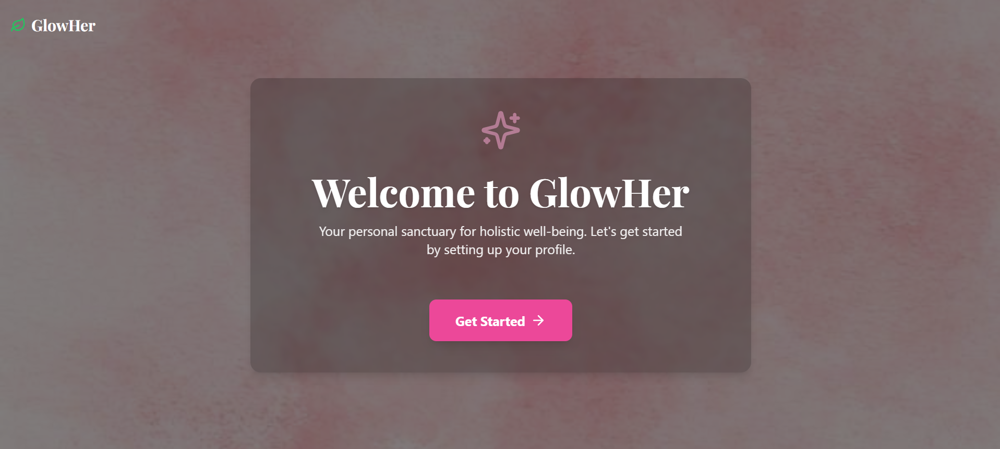

 

### 🚀 About Me

- 🎓 **B.Tech, Mathematics & Computing** @ Madhav Institute of Technology & Science (MITS), Gwalior *(2024–2028)*
- 💼 Completed **AI/ML Engineering Internship** @ DecodeLabs
- 🧠 Building products around **NLP, recommendation systems & generative AI**
- 🎨 Also a **Graphic Designer** — I design the UI/UX and visuals for my own products
- ⚡ Fun fact: I've shipped 4 live full-stack apps solo while still in college

---

### 🏆 Achievements & Recognition

<table>
<tr>
<td width="50%" valign="top">

**🏅 Hackathons**
- 🥇 Rank **7th / 500+ teams** — GDGoC DevSprint Hackathon 2026
- 🎯 **Finalist** — HackOrbit 2025 (36-hr, 600+ teams, National)
- 🎯 **Semi-Finalist** — Google Girl Hackathon 2025

</td>
<td width="50%" valign="top">

**📜 Certifications & Programs**
- 🎖️ **Legend Tier · 86 Skill Badges** — Google Arcade Program
- 📊 Data Visualisation for Business — Tata Group (Forage)
- 🇮🇳 Yuva AI for All — NIELIT, MeitY, Govt. of India (2026)
- 🌱 Open Source Contributor — GirlScript Summer of Code 2025

</td>
</tr>
</table>

---

### 🛠️ Tech Arsenal

 

 

 

 

---

### 📌 Featured Projects

<!-- Screenshots pulled from assests/screenshot/ in this repo -->

<table>
<tr>

<td width="50%">

**🛡️ [Femigo](https://github.com/hiral17234/FemigoApp)**

Women's safety app — SOS alerts, live tracking, fake-call trigger

`Next.js` `Genkit` `Leaflet`

</td>

  <td width="50%">

**🗳️ [CampusVoice](https://github.com/hiral17234/Campus-Voice)**

Anonymous campus issue-management platform with real-time role-based dashboards

`React` `Firebase` `Firestore` `Cloudinary`

</td>

</tr>

<tr>

<td width="50%">

**📚 [NoteHall](https://github.com/hiral17234/NoteHall)**

Peer-to-peer academic resource sharing with AI Q&A over study material

`React` `Firebase` `Gemini 2.5 Flash`

</td>
  
<td width="50%">

**🌸 [GlowHer](https://github.com/hiral17234/GlowHer)**

Women's health & wellness platform with AI-personalised, privacy-first insights

`Next.js` `Genkit AI` `Gemini API`

</td>

</tr>
</table>

---

### 📊 GitHub Stats

---

### 💬 Let's Connect & Build Something Great

